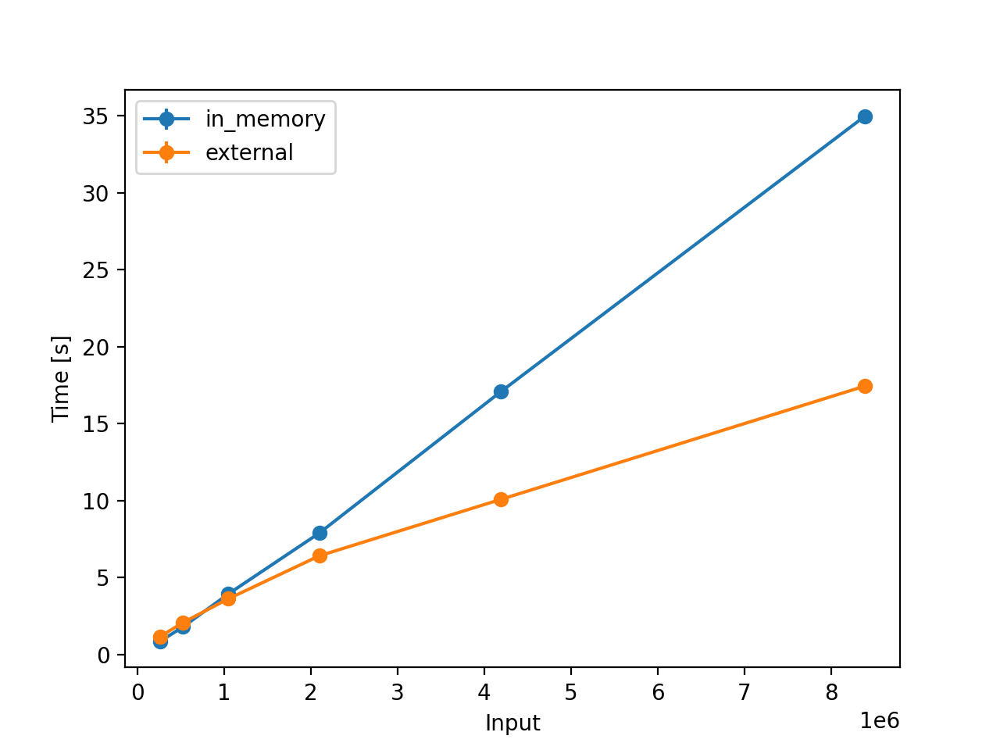
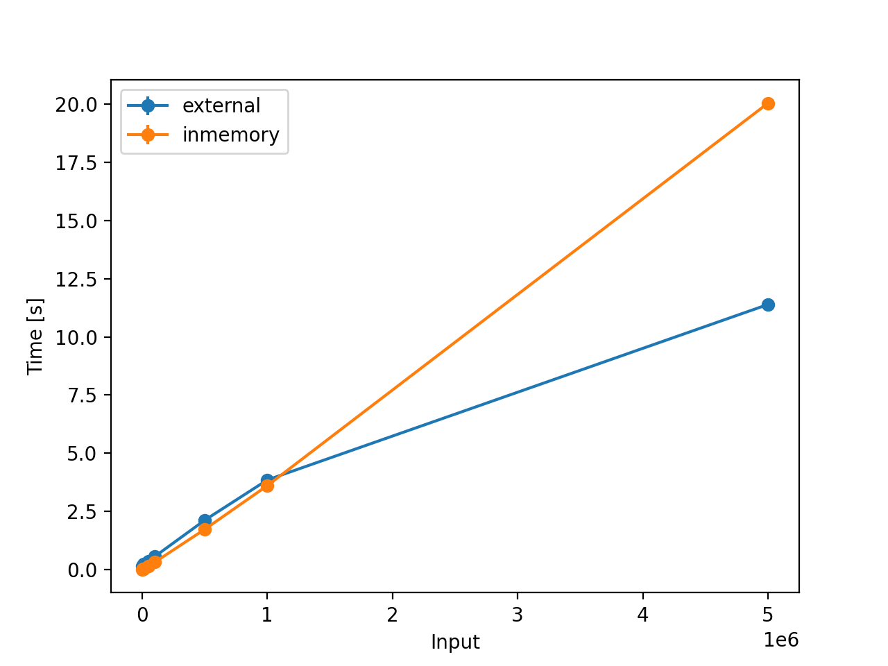
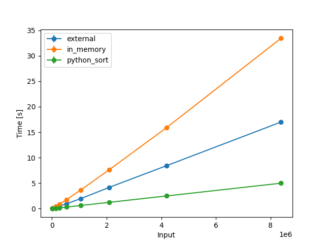

# Comparison of Sorting Algorithms 🚀

## Installation

- Install `virtualenv` ([Reference](https://packaging.python.org/en/latest/guides/installing-using-pip-and-virtual-environments/))

```
python3 -m pip install --user --upgrade pip
python3 -m pip --version
python3 -m pip install --user virtualenv
```

- Create a virtual environment and install dependencies

```
python3 -m venv env
source env/bin/activate
python3 -m pip install -r requirements.txt
```

## Usage

To compare the time taken by the sorting algorithm(s), import the class in `plot_graph.py` and call the sorting algorithm and specify the input range.

For example, comparing the in-memory and external merge sort, we have the following results:

- For Powers of 2:




- For Powers of 10:



# External Merge Sort

Taking an example, consider the input array `[5, 8, 6, 3, 7, 1, 4, 9, 10, 2]` 

## Split Phase:
- Split the input into chunks (5 chunks).
- Sort each of the individual chunks.
- Store the sorted chunks in files (5 temporary files).

Doing so, we have 5 files with:
- Chunk 1: `[5, 8]`
- Chunk 2: `[3, 6]`
- Chunk 3: `[1, 7]`
- Chunk 4: `[4, 9]`
- Chunk 5: `[2, 10]`

## Merge Phase:
- Create `m` number of `HeapNode`(s), where the value of the `HeapNode` is the chunk's lowest element, and store the reference to the temporary chunk file.
Example:
```
{
	"element": 5,
	"file": "Chunk 1"
}
```
- Now, store all the `m` `HeapNode`(s) in a Min Heap, where the top node is always the minimum element in the heap:

```
                         1                       
                       /  \
                      2    5
                    /  \                         
                   4    3     
```
- Perform the `heapify` operation -> store the element in an output file -> replace the min element with the next element in the chuck file, which owns min element

- Pick the min element in the min-heap `1` and write it to an output file `1`
- Find the next element in the chunk file, which owns min element `1`
- Number `7` from `Chunk 3`; move it to the heap and perform `heapify`
```
      7                                    2
    /  \                                 /  \
   2     5      Heapify -->             3    5	
  /  \                                 / \
 4    3                               4   7 
```


- Pick the min element `2` and append it to output file `1, 2`
- Find the next element in the chunk file, which owns min element `2`
- Number `10` from `Chunk 5`; move it to the heap and perform `heapify`
```
      10                                   3
    /  \                                 /  \
   3     5      Heapify -->             4    5	
  /  \                                 / \
 4    7                               10   7 
```


- Pick the min element `3` and append it to output file `1, 2, 3`
- Find the next element in the chunk file, which owns min element `3`
- Number `6` from `Chunk 2`; move it to the heap and perform `heapify`
```
      6                                   4
    /  \                                 /  \
   4     5      Heapify -->             6    5	
  /  \                                 / \
10   7                               10   7 
```

- Pick the min element `4` and append it to output file `1, 2, 3, 4`
- Find the next element in the chunk file, which owns min element `4`
- Number `9` from `Chunk 4`; move it to the heap and perform `heapify`

```
      9                                   5
    /  \                                 /  \
   6     5      Heapify -->             6    9	
  /  \                                 / \
10   7                               10   7 
```

- Pick the min element `5` and append it to output file `1, 2, 3, 4, 5`
- Find the next element in the chunk file, which owns min element `5`
- Number `8` from `Chunk 1`; move it to the heap and perform `heapify`


```
      8                                   6
    /  \                                 /  \
   6     9      Heapify -->             7    9	
  /  \                                 / \
10   7                               10   8 
```

- If the next element in the chunk file is smaller than the current min element, replace the min element in `MAX_INTEGER` and repeat the process until all the elements in the heap are `MAX_INTEGER`

- Pick the min element `6` and append it to output file `1, 2, 3, 4, 5, 6`
- Find the next element in the chunk file, which owns min element `6`
- When you see `EOF (End of Line)`, replace it with `MAX_INTEGER`

```
   MAX_INT                                 7
    /  \                                 /  \
   7    9      Heapify -->              8     9	
  /  \                                 / \
10   8                               10   MAX_INT
```
- Continue until the heap looks like:

```
                       MAX_INT                       
                        /   \
                    MAX_INT  MAX_INT
                    /    \                         
                 MAX_INT MAX_INT        
```

The final output: `1, 2, 3, 4, 5, 6, 7, 8, 9, 10` 😎

Note: External Merge Sort algorithm is this code-base uses python's `sorted()` for sorting chucks; hence it can never be better than `sort()` or `sorted()`


